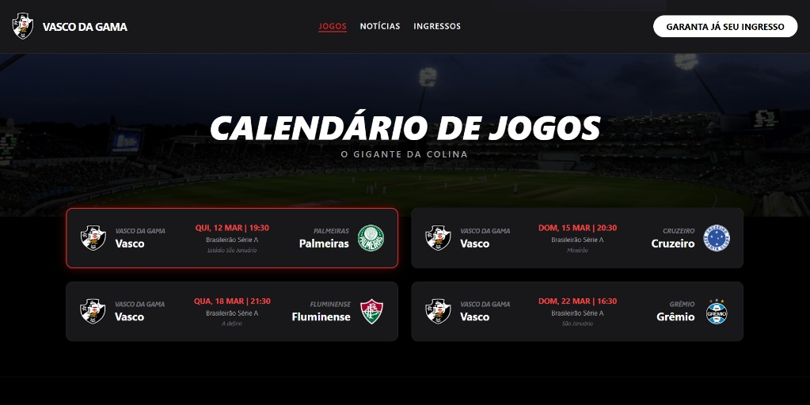

# 🏟️ Landing Page - Próximos Jogos do Vasco

Este projeto é uma landing page dinâmica que exibe o calendário de jogos do Vasco da Gama, desenvolvida com foco em performance e design minimalista.

## 🚀 Tecnologias Utilizadas
* **HTML5** e **CSS3**
* **Tailwind CSS** (Estilização responsiva)
* **JavaScript ES6** (Manipulação dinâmica de dados)

## 📱 Funcionalidades
- Listagem de jogos a partir de um Array de objetos.
- Design totalmente responsivo (Mobile First).
- Efeito de destaque (Glow) para o próximo jogo.
- Links diretos para compra de ingressos e notícias oficiais.

## 📸 Demonstração

## 🛠️ Como rodar o projeto
1. Clone este repositório.
2. Abra o arquivo `index.html` no seu navegador.

<!--
**potter1v4/potter1v4** is a ✨ _special_ ✨ repository because its `README.md` (this file) appears on your GitHub profile.

Here are some ideas to get you started:

- 🔭 I’m currently working on ...
- 🌱 I’m currently learning ...
- 👯 I’m looking to collaborate on ...
- 🤔 I’m looking for help with ...
- 💬 Ask me about ...
- 📫 How to reach me: ...
- 😄 Pronouns: ...
- ⚡ Fun fact: ...
-->
